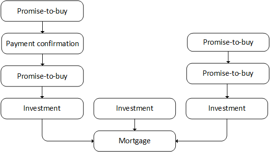

# Decentralized Mortgage Market

This project implements a decentralized mortgage market where home buyers and banks can meet and negotiate mortgage agreements, and banks can sell pieces of these mortgages to investors. In turn, investors can also resell their investment to other investors. This market is completely decentralized, is blockchain-regulated and runs on Dispersy, a messaging platform.

# Peer discovery

The decentralized mortgage market uses Dispersy for peer discovery (see [ReadTheDocs](https://dispersy.readthedocs.io/)). Upon finding a new peer, it exchanges its public key, its role in the network (i.e., home buyer, bank, investor), and information regarding its real world identity (e.g., name). For a few banks their public keys are hard-coded in the software. However, in future versions we plan to give the user the opportunity to provide their own public keys (which the user could find on a bank's website, for instance).

# Contracts

Every agreement reached in the market, is recorded in a double-signed contract. We currently distinguish between three types of contracts:
- **Mortgage contracts** represent the original agreement between the home buyer and the bank.
- **Investment contracts** represent the part of the mortgage that is sold to an investor.
- **Promise-to-buy contracts** record the promise between buyer and seller to transfer ownership of an investment in exchange for some monetary payment.
- **Payment confirmation contracts** record the confirmation of payment, and must be linked to a promise-to-buy contract. Unlike other contracts, this contract does not record an agreement between two parties, but merely confirms an event.

## Agreements

Before creating a contract, an agreement must be made about its contents. For instance, a mortgage contract would include the address of the underlying collateral.

Generally speaking, agreements are made using the following basic scheme:

Depending on the type of agreement peers A and B are:

| Agreement type | peer A | peer B |
|-------------|------------|----------|
| Mortgage | home buyer | bank |
| Investment | bank* | investor |
| Promise-to-buy | investor* | investor |

(* means the first message is broadcasted)

## Signatures

Once an agreement is made either party creates a contract, signs it by appending an Ed25519 signature, and offers it to other party for signing.

## Dependencies

With the exception of mortgage contracts, all contracts must have a single dependency. Investment contracts must depend on mortgage contracts, promise-to-buy contracts must depend on investment contracts, and payment confirmation contracts must depend on promise-to-buy contracts (see the figure below for an example). 

# Blockchain

Right after a contract has been signed, both parties multicast the contract to the banks. The banks, in turn, are tasked with storing these contracts on a the blockchain. To this end, banks keep a list of incoming contracts in memory. Periodically, banks will try to create a new block of contracts. Contracts are only selected to be in a block if all their dependencies have already been selected.

Block creation is only considered successful if it meets a certain target difficulty. Once a bank successfully generates such a block, it multicast the block to the other banks. For the next block, the difficulty will automatically re-target to achieve a predefined average block creation interval (currently set to 3 minutes).

Besides meeting the target difficulty, blocks have to satisfy several other requirements. For instance, banks are required to timestamp and sign their blocks. Additionally, they need to be in the possession of some kind of minimum value on the network (proof-of-stake), making Sybil attacks overly costly.

While extended branches should be rare, the market is able to cope with such issues by always choosing the longest chain of blocks as the winning chain.

The market does not offer any kind of monetary incentive for creating blocks, instead banks will have to create blocks simply because they cannot risk a potential malicious bank from putting incorrect contracts on the blockchain.

For sake of simplicity, the current maximum size of a block is only 1472 bytes, a limit chosen such that blocks can fit in a single UDP packet without risking IP fragmentation.
